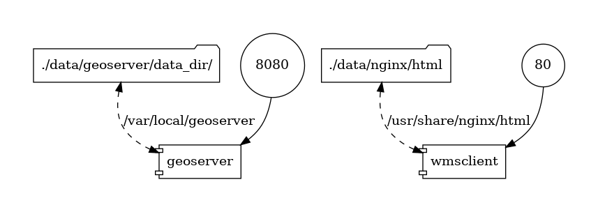

# satellite-geoserver
Docker-compose que ensambla los componentes necesarios para implementar una instancia Geoserver que publica mapa base de imagenes satelitales basadas en tiles generados por [ESA EOX](http://maps.eox.at/) (nota: revisar licencia de uso en caso de implementar en sistemas productivos públicos).

En la práctica el objetivo de este ejemplo es brindar una estructura de mapa base raster de alcance global, que:

- provea suficiente detalle visual (resolución espacial del tipo GoogleMaps o similar)
- pueda montarse de forma particular, sin necesidad de contratar/pagar el servicio de terceros.
- este razonablemente actualizado (en términos de fechas)

El ensamble que aqui se detalla se puede aplicar con diferentes fuentes de datos. En nuestro caso utilizamos [ESA EOX S2Maps](https://s2maps.eu/), ya que nos permite obtener imágenes con nivel de zoom 15 (pixeles de hasta 10m), brindando buen detalle, que son generadas a partir de dataset de la plataforma Sentinel, para fecha 2020, y que estan accesibles al público sin costo.

Los archivos GPKG utilizados para almacenar los tiles/teselas fueron recopilados utilizando [MapProxy](https://mapproxy.org/). En la práctica, los scripts que se adjuntan en este seteo permiten hacer el setup utilizando dichos archivos (para los diferentes niveles de zoom, que luego componen el mapa base raster).

## Pasos

Con los scripts que se incluyen en la carpeta hemos simplificado los pasos a seguir para desplegar una solución que incluye un Geoserver publicando un conjunto de capas raster que permitan visualizar una capa base a escala global (con niveles de zoom de 0 a 10), con posibilidad de mejorar la escala sobre ciertas areas seleccionadas (zoom en niveles de 11 a 15). 

Esta simplificación está condicionada a que el despliegue se realice especificamente en un mismo host (en el cual se ejecutará el docker-compose que inicializa el sistema). En caso de tener que hacer un despligue en mas de un host, hay que contemplar algunos aspectos técnicos (los mismos que llevar de docker-compose a swarm o a kubernetes).

La idea es mantener el caso de uso simple (debajo esta el diagrama de contenedores y volumenes a crear).

Los pasos son:

1. Instalar [git](https://github.com/git-guides/install-git), [docker](https://docs.docker.com/engine/install/ubuntu/) y [docker-compose](https://docs.docker.com/compose/install/) en la máquina host.

   Ejemplo comandos basado en distribución Ubuntu:

   a. **sudo apt update**

   b. **sudo apt install git**

   c. **sudo apt-get install docker-ce docker-ce-cli containerd.io**

   d. **sudo curl -L "https://github.com/docker/compose/releases/download/1.29.2/docker-compose-$(uname -s)-$(uname -m)" -o /usr/local/bin/docker-compose**

   e. **sudo chmod +x /usr/local/bin/docker-compose**

2. Descargar el repositorio git de este proyecto.

   a. **git clone https://github.com/geotekne/docker-compose-samples.git**

3. Descargar los archivos correspondientes a los datasets de mosaicos/teselas raster que se utilizarán, ejecutando el script **./setup-datasets.sh**

4. Habiendo finalizado el paso 3 (con la descarga de los datasets confirmada), ejecutar el script **./startup.sh**  

4. Abriendo un navegador, en http://localhost, se encontrara una aplicacion simple de testing, sobre la cual se tiene la opcion de navegar los mapas de **Sentinel2 Maps** o de **satellite-local**, versión que apunta a su servidor local que renderiza los datasets locales.

   

Observaciones : 

- Los datasets que se comparten dependen de las condiciones de licenciamiento que se mencionan en [s2maps.eu](https://s2maps.eu/).

- Especificamente, la aplicacion demo que adjuntamos hace mención a la fuente de datos, así como en los metadatos adjuntos a las teselas renderizadas por Geoserver, se brinda el mismo detalle.

  

## Detalle Técnico
- Una instancia de cada servicio

- Imagenes utilizadas
  - geoserver: geotekne/geoserver:pear-alpine-2.16.2
  - wmsclient: nginx, que mapea la aplicación web simple (creada con OpenLayers) que permite seleccionar entre utilizar ESA EOX como fuente de datos del mapa, o bien utilizando la instancia local de mapa base raster (satellite-local)
  
- Volumen de datos de Geoserver mapeado a carpeta en host, y sobre la que el contenedor mapproxy-seed vuelca el gpkg contenedor de teselas que se genera a partir del área seleccionada (a partir de shapefile en carpeta ./data/mapproxy/shps/) para descarga de los niveles 11 a 15.

- Volumen de datos de Nginx mapeado a carpeta en host (donde esta la app OpenLayers)

- Puertos mapeados en host:

  - geoserver: 8080
  - wmsclient: 80

  

## Diagrama

